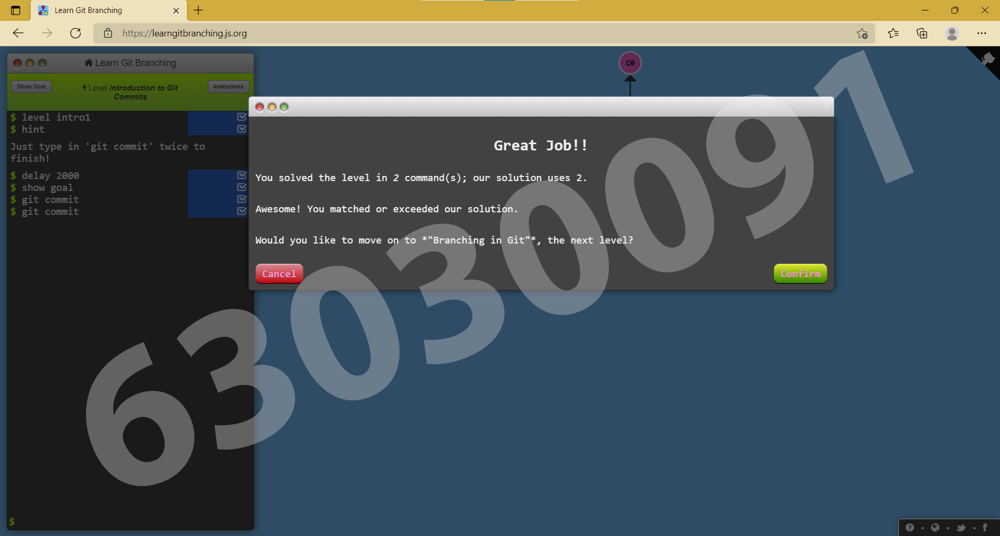
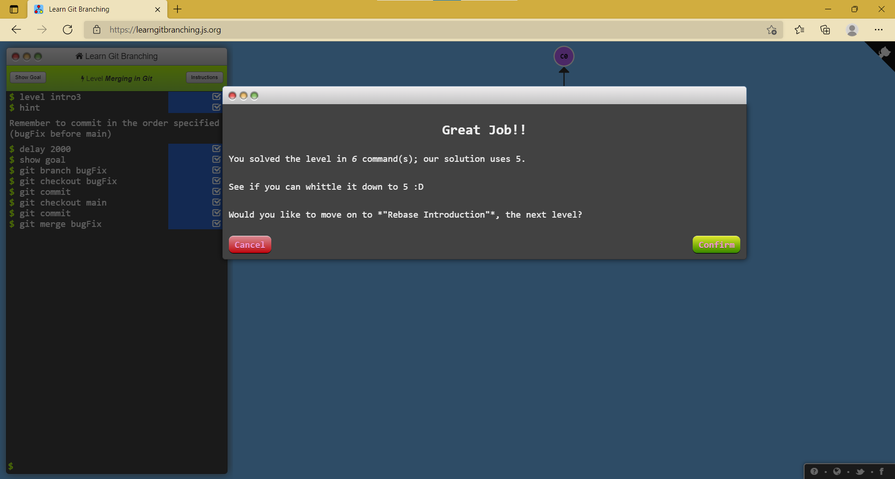

# Week 13 #

## ใบงาน

ให้ฝึกทำการ branching  จาก  https://learngitbranching.js.org/ แล้ว capture ผลลัพธ์ส่งใน pull request

## ผลการเล่นเกมส์ Introduction Sequence

Level 1.1 Introduction to Git Commits

---

Level 1.2 Branching in Git

---

Level 1.3 Merging in Git

---

Level 1.4 Rebase Introduction

---

ตารางสรุปผล

---
