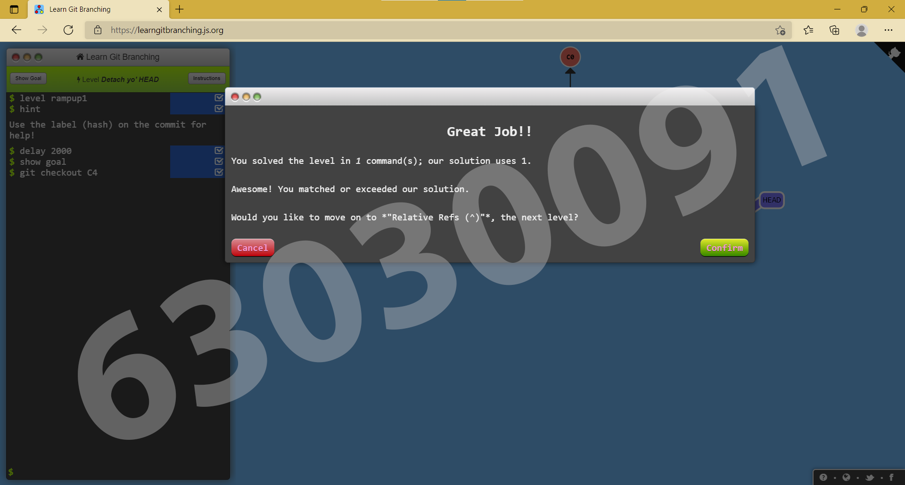
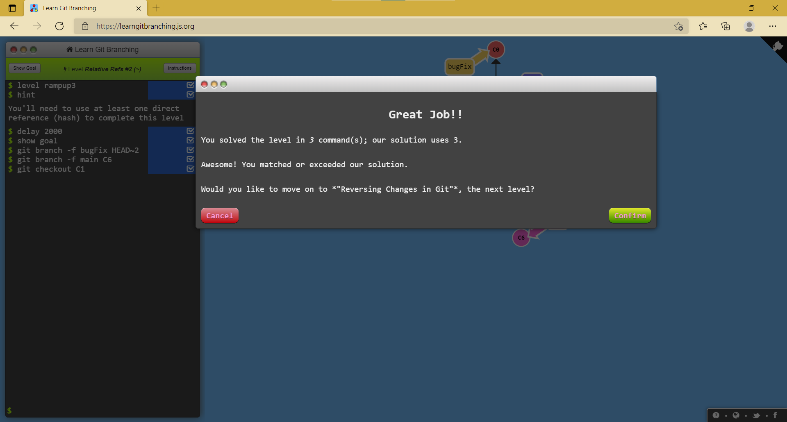
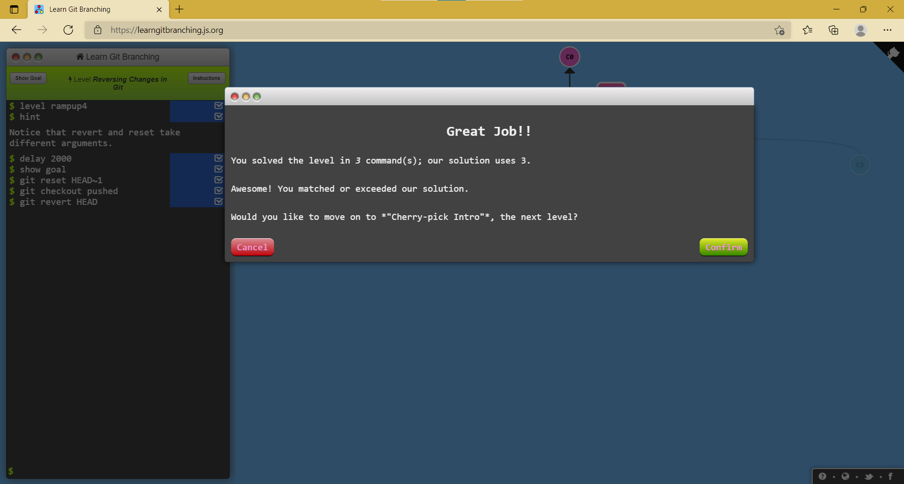
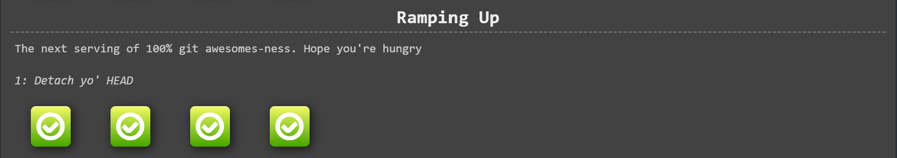

# Week 13 #

## ใบงาน

ให้ฝึกทำการ branching  จาก  https://learngitbranching.js.org/ แล้ว capture ผลลัพธ์ส่งใน pull request

## ผลการเล่นเกมส์ Ramping Up

Level 2.1 Detach yo' HEAD

---

Level 2.2 Relative Refs (^)

---

Level 2.3 Relative Refs #2 (~)

---

Level 2.4 Reversing Changes in Git

---

ตารางสรุปผล

---
