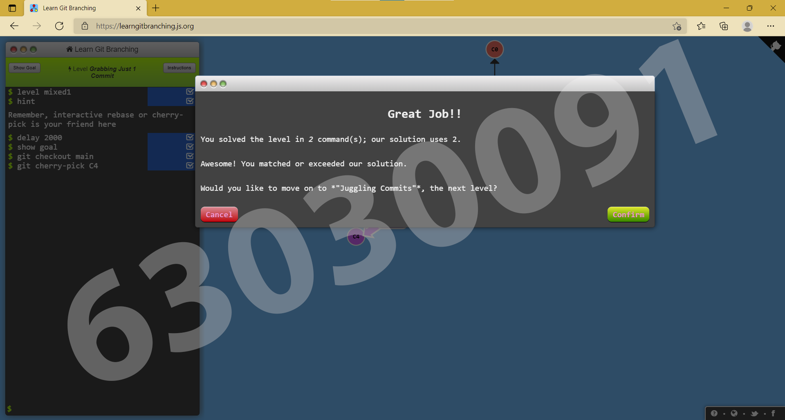
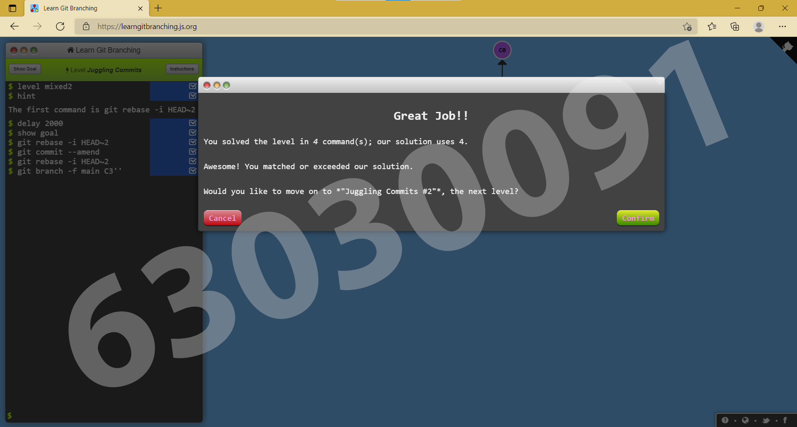
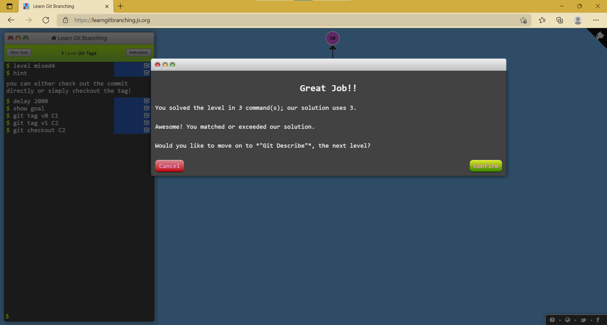
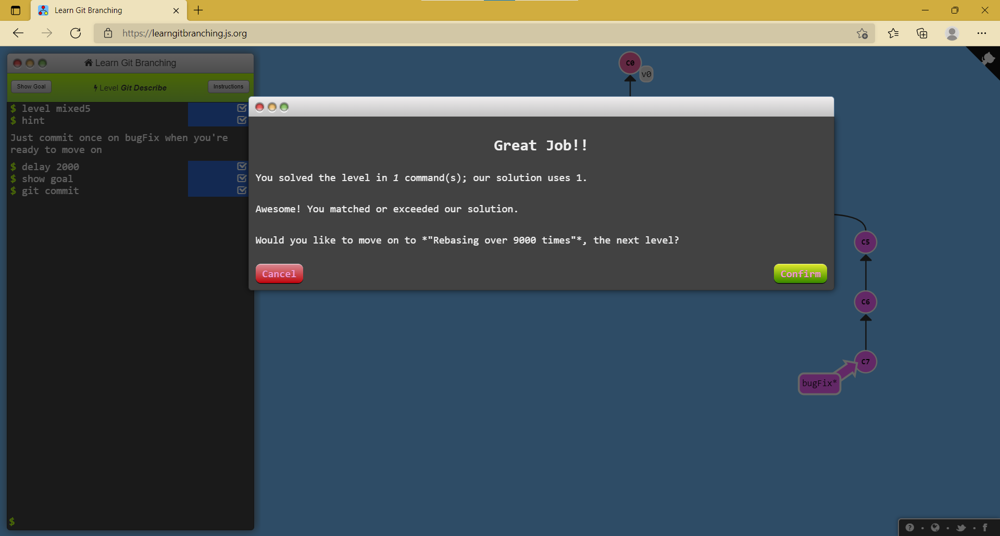
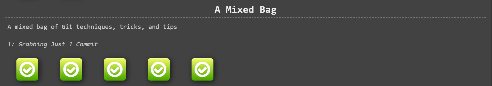

# Week 13 #

## ใบงาน

ให้ฝึกทำการ branching  จาก  https://learngitbranching.js.org/ แล้ว capture ผลลัพธ์ส่งใน pull request

## ผลการเล่นเกมส์ A Mixed Bag

Level 4.1 Grabbing Just 1 Commit

---

Level 4.2 Juggling Commits

---

Level 4.3 Juggling Commits #2

---

Level 4.4 Git Tags

---

Level 4.5 Git Describe

---

ตารางสรุปผล

---
