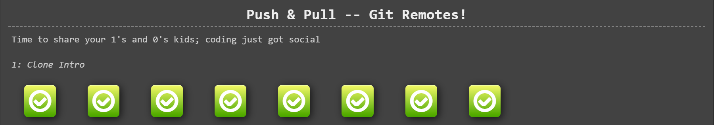

# Week 13 #

## ใบงาน

ให้ฝึกทำการ branching  จาก  https://learngitbranching.js.org/ แล้ว capture ผลลัพธ์ส่งใน pull request

## ผลการเล่นเกมส์ Push & Pull -- Git Remotes!

Level 1.1 Clone Intro

---

Level 1.2 Remote Branches

---

Level 1.3 Git Fetchin'

---

Level 1.4 Git Pullin'

---

Level 1.5 Faking Teamwork

---

Level 1.6 Git Pushin'

---

Level 1.7 Diverged History

---

Level 1.8 Locked Main

---

ตารางสรุปผล

---
