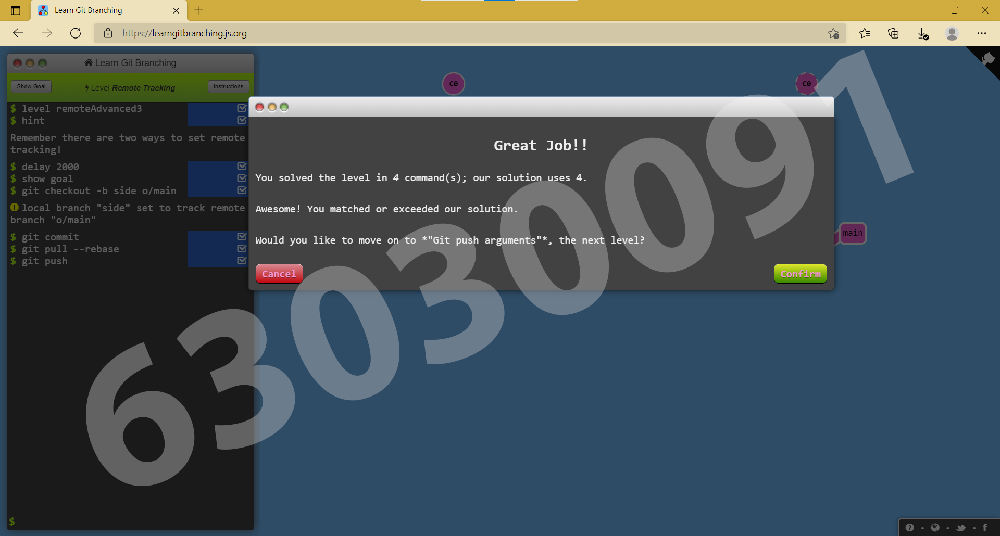
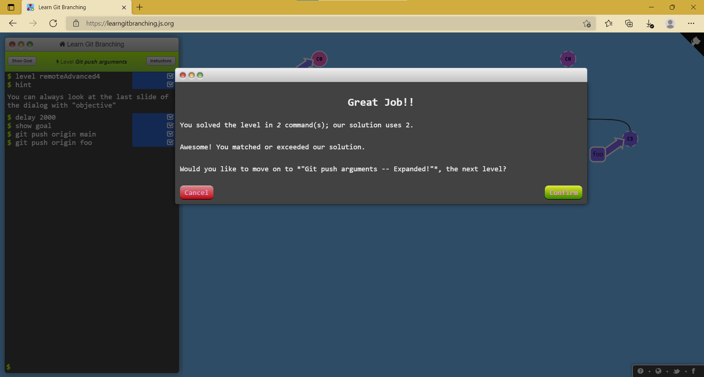
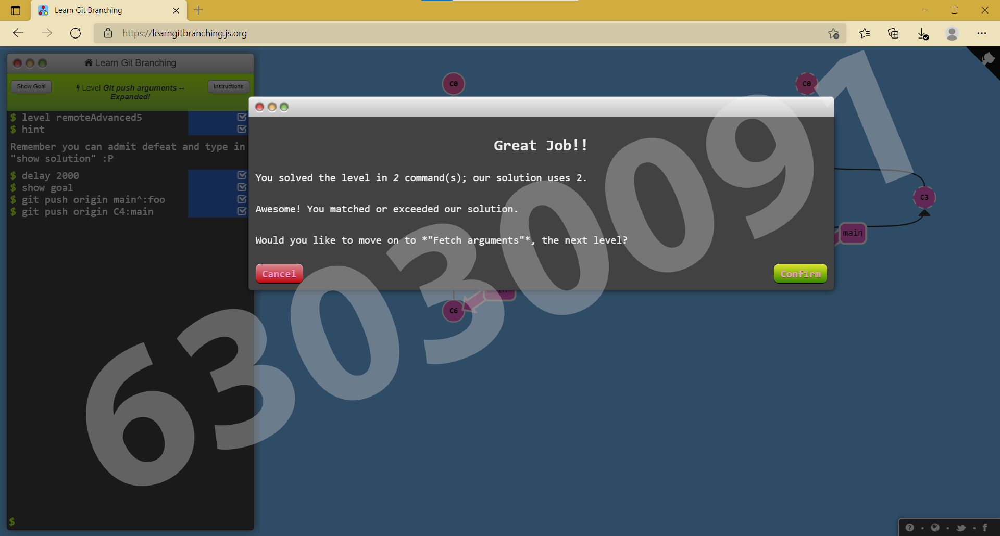
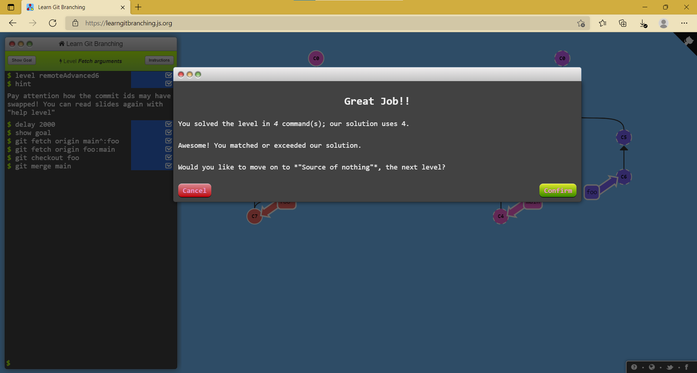

# Week 13 #

## ใบงาน

ให้ฝึกทำการ branching  จาก  https://learngitbranching.js.org/ แล้ว capture ผลลัพธ์ส่งใน pull request

## ผลการเล่นเกมส์ To Origin And Beyond -- Advanced Git Remotes!

Level 2.1 Push Main!

---

Level 2.2 Merging with remotes

---

Level 2.3 Remote Tracking

---

Level 2.4 Git push arguments

---

Level 2.5 Git push arguments -- Expanded!

---

Level 2.6 Fetch arguments

---

Level 2.7 Source of nothing

---

Level 2.8 Pull arguments

---

ตารางสรุปผล

---
